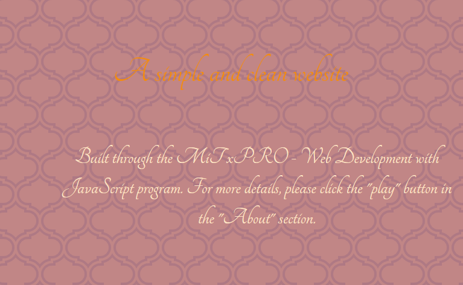

# Personal Website

<a href="https://marinela26.github.io/Personal-Website/#HOME">Demo here</a>

## Table of Contents
* [Screenshots](#screenshots)
* [General Info](#general-information)
* [Technologies Used](#technologies-used)
* [Setup](#setup)
* [Room for Improvement](#room-for-improvement)
* [Acknowledgements](#acknowledgements)
* [Contact](#contact)
* [License](#license)

## Screenshots

## General Information

## Technologies Used
- Tech 1 - version 1.0
- Tech 2 - version 2.0
- Tech 3 - version 3.0

## Setup

## Room for Improvement
Include areas you believe need improvement / could be improved. Also add TODOs for future development.

Room for improvement:
- Improvement to be done 1
- Improvement to be done 2

To do:
- Feature to be added 1
- Feature to be added 2

## Acknowledgements
Give credit here.
- This project was inspired by...
- This project was based on [this tutorial](https://www.example.com).
- Many thanks to...

## Contact
Created by Marinela Togoe

Email: marinelatogoe@gmail.com

 ## License
 
This project is available under the [MiT License](). 

